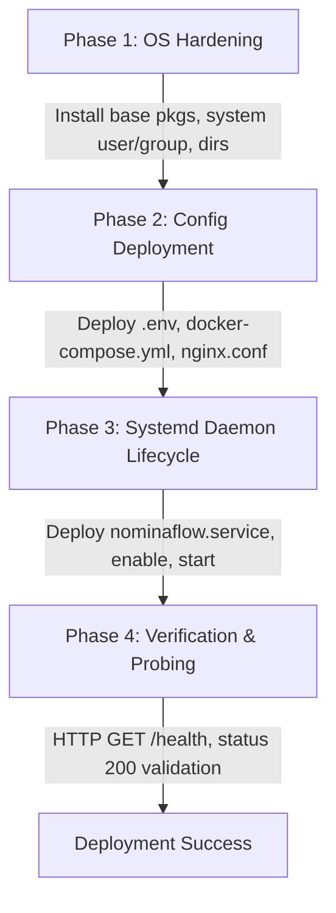

# Week 13 Deliverable: Infrastructure as Code & Configuration Management with Ansible

## 1. Executive Summary & Objective
Week 13 introduces **Infrastructure as Code (IaC)** and **Automated Configuration Management** for the NominaFlow platform using Ansible. The goal is to eliminate manual server configuration, prevent configuration drift across deployment environments (staging, production), and provide declarative, repeatable infrastructure provisioning.

---

## 2. Infrastructure Architecture & Inventory

### 2.1 Agentless Architecture
Ansible operates without running background agent daemons on target hosts. Communication is established purely over secure OpenSSH channels with Python 3 execution on target machines.

### 2.2 Inventory Topology (`ansible/inventory.ini`)
```ini
[staging]
staging-server ansible_host=192.168.1.50 ansible_user=deployer ansible_python_interpreter=/usr/bin/python3

[production]
prod-server-01 ansible_host=192.168.1.100 ansible_user=deployer ansible_python_interpreter=/usr/bin/python3
prod-server-02 ansible_host=192.168.1.101 ansible_user=deployer ansible_python_interpreter=/usr/bin/python3

[localhost]
localhost ansible_connection=local ansible_python_interpreter=/usr/bin/python3
```

---

## 3. Playbook Structure (`ansible/playbook.yml`)

The automation workflow executes through 4 distinct phases:



### Key Modules Utilized:
1. `ansible.builtin.package`: Manages base Linux packages (`curl`, `ca-certificates`, `rsyslog`).
2. `ansible.builtin.user` & `group`: Enforces least-privilege system account isolation (`nominaflow` UID/GID).
3. `ansible.builtin.file`: Sets POSIX access permissions (`0750` directories, `0600` secret files).
4. `ansible.builtin.copy`: Transports version-controlled Docker and Nginx configurations.
5. `ansible.builtin.systemd`: Manages Linux OS service units and ensures daemon reload on changes.
6. `ansible.builtin.uri`: Performs end-to-end integration health probing (`/health`) with retries.

---

## 4. Key Verification Metrics
- **Syntax Check**: `ansible-playbook -i ansible/inventory.ini ansible/playbook.yml --syntax-check`
- **Dry-Run (Check Mode)**: `ansible-playbook -i ansible/inventory.ini ansible/playbook.yml --check`
- **Idempotency Guarantee**: Successive runs yield `changed=0`, proving complete convergence to the desired state.
