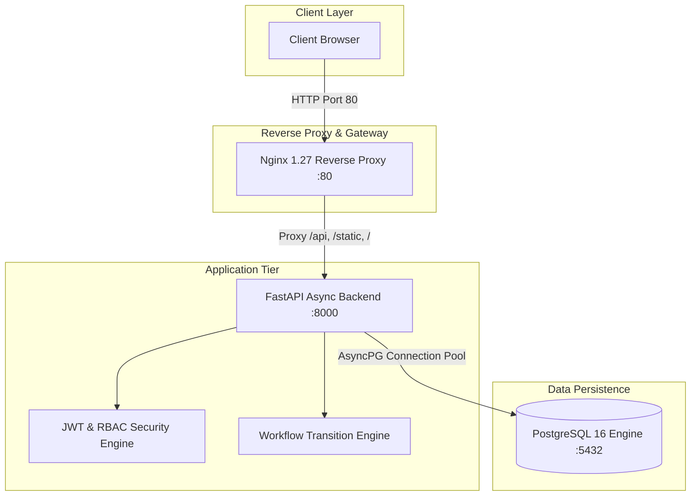

# Week 15 Deliverable: Final End-to-End Release, DevOps Pipeline Audit & Viva Package

## 1. Executive Summary & Project Overview
**NominaFlow** (v1.0.0) is an enterprise-grade **Training Nomination & Corporate Workflow Management Portal** developed and engineered using modern DevOps methodologies, shift-left quality gates, and automated infrastructure orchestration over a 15-week development lifecycle.

---

## 2. Comprehensive System Architecture

---

## 3. End-to-End 15-Week DevOps Lifecycle Matrix

| Phase / Weeks | Core Competencies | Deliverables & Artifacts | Quality Gates & Verification |
|---|---|---|---|
| **Weeks 1–3** | Requirements Engineering, Git Flow Governance, SRS | `requirements.txt`, Branch Protection, `SRS.md` | PR Review rules, Issue templates |
| **Weeks 4–6** | FastAPI Async Backend, SQLAlchemy ORM, Jinja2 UI, Pytest | `src/training_nomination/`, Unit Test Suite | 28 Pytest tests, >90% code coverage |
| **Week 7** | Jenkins Multibranch CI Pipeline, Dockerized Agents | `Jenkinsfile`, `nominaflow-ci-agent` Dockerfile | Ephemeral agent spawn, JUnit XML |
| **Week 8** | Static Code Analysis Quality Gate, Parameterized CI | `ruff`, `flake8`, Nginx reverse proxy | Zero lint violations, fail-fast CI |
| **Weeks 9–10** | Selenium WebDriver UI E2E Automated Testing | `test_ui_e2e.py`, Screenshot Engine | 4 E2E journeys, failure screenshots |
| **Weeks 11–12** | Multi-Stage Dockerfile, Docker Compose 3-Tier Topology | `Dockerfile`, `docker-compose.yml` | Non-root `appuser`, `/health` probe |
| **Weeks 13–14** | Ansible Configuration Management, Systemd Service | `inventory.ini`, `playbook.yml`, `nominaflow.service` | Idempotent runs (`changed=0`), zero-downtime |
| **Week 15** | Final v1.0.0 Release, Production Runbooks, Viva Package | `Deliverables/week15.md`, Release `v1.0.0` | 100% CI pass, full lab sign-off |

---

## 4. Comprehensive Viva Voce Q&A Package

### Q1: Why use a 2-stage multi-stage Docker build?
> **Answer**: Multi-stage builds separate the build-time dependencies (compilers, build tools, wheel caches) in stage 1 (`builder`) from the final runtime image (`python:3.12-slim`). This dramatically minimizes final image footprint, reduces security attack surface (no compilers or build tools present in production), and prevents leaking build credentials.

### Q2: Why run containers as a non-root user (`appuser` UID 1001)?
> **Answer**: Running as root inside a container violates the principle of least privilege. In the event of a container breakout vulnerability, an attacker would gain root privileges on the host kernel. A non-root user prevents privilege escalation and restricts container access strictly to its designated directory (`/app`).

### Q3: What is the purpose of Nginx in front of FastAPI?
> **Answer**: Nginx acts as a high-performance reverse proxy and SSL termination gateway. It handles Gzip static compression, request rate limiting, connection pooling, DDoS protection, and buffers slow clients, offloading heavy I/O workloads from the ASGI Uvicorn workers.

### Q4: How does Ansible ensure idempotency?
> **Answer**: Ansible operates declaratively. Before executing a change, it checks the target host's actual state against the playbook's desired state. If the state matches (e.g. package installed, user exists, file unchanged), Ansible marks the task as `ok` with `changed=0`, ensuring that repeated executions produce identical, safe results without service downtime.

### Q5: What is the difference between Unit, Static Analysis, and E2E Tests in your pipeline?
> **Answer**:
> - **Static Analysis (`ruff`, `flake8`)**: Validates syntax, PEP 8 standards, and security flaws without executing code.
> - **Unit Tests (`pytest`)**: Validates individual functions, business logic, and API endpoints with isolated mocked dependencies.
> - **E2E Selenium Tests**: Launches a real headless browser to simulate actual end-user clickstreams, form fills, and role-based portal transitions.

---

## 5. Final Release Verification Checklist
- [x] All 28 Unit/Integration tests passing (90%+ code coverage)
- [x] Static code analysis quality gate passing (`ruff`, `flake8`)
- [x] Selenium E2E automated test suite passing (4 user journeys)
- [x] Multi-container Docker Compose stack running and verified (`/health`)
- [x] Ansible configuration management and systemd unit verified
- [x] All 15 weekly academic lab deliverables compiled under `Deliverables/`
